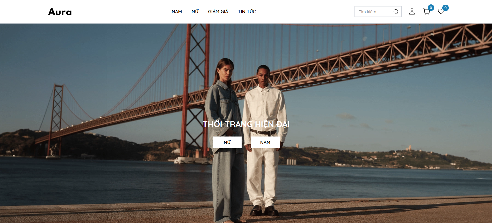
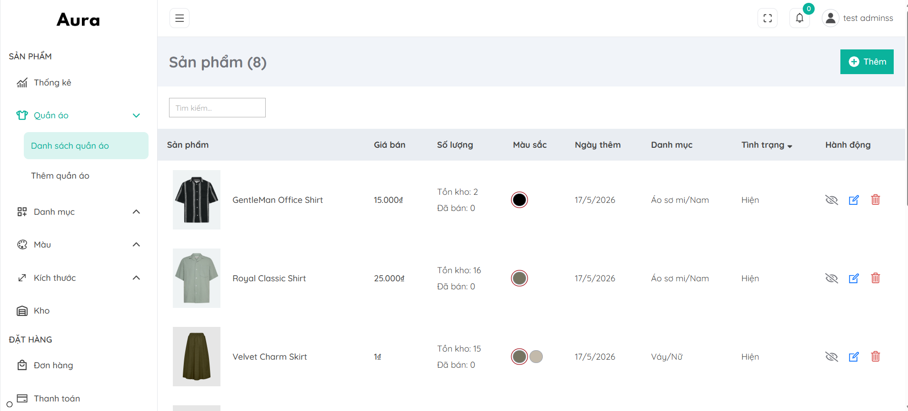

# WEBSITE THƯƠNG MẠI ĐIỆN TỬ THỜI TRANG

Xây dựng nền tảng thương mại điện tử thời trang với đầy đủ tính năng từ quản lý sản phẩm đa biến thể (màu sắc, kích thước) đến quy trình mua hàng hoàn chỉnh. Hệ thống bao gồm giao diện quản trị riêng biệt dành cho admin, cho phép kiểm soát toàn bộ hoạt động của cửa hàng.





## Demo

Website: [](https://fashion-aura-ten.vercel.app)

Admin: [](https://fashion-aura-admin.vercel.app)

## Cài đặt môi trường

**1. Clone repository**

```
https://github.com/lamquang4/fashion-ecommerce.git
```

**2. Chạy website bằng Docker**

```
docker compose up --build
```

## Công nghệ sử dụng

| Danh mục    | Tools / Frameworks                                    |
| ----------- | ----------------------------------------------------- |
| Frontend    | Next.js + TypeScript <br> TailwindCSS <br> Axios + SWR |
| Backend/API | Next.js App Router API Routes + Node.js + NextAuth.js |
| Database    | MongoDB                                               |
| Storage     | Cloudinary                                            |
| Deployment  | Vercel                                                |
